# 📊 Missing Data Industry Playbook - v1

> *A systematic simulation-based evaluation of missing data imputation strategies for multivariate time-series sensor data*

🎯 **Inspired by:** Industrial IoT, SDN telemetry, EV/V2G monitoring environments

---

## 🔍 Framework Scope

The framework explicitly models:

- ⏳ Realistic temporal dynamics
- 🔗 Cross-sensor dependencies
- 🧩 Three fundamental missingness mechanisms: **MCAR**, **MAR**, **MNAR**

---

## 1️⃣ Ground Truth Generation & Validation

> *Before evaluating any imputation strategy, it is critical to validate that the ground truth data itself is statistically and physically plausible.*  
> This phase establishes the baseline signal properties that all later imputation results depend on.

### 📈 Ground Truth Time Series (All Sensors)

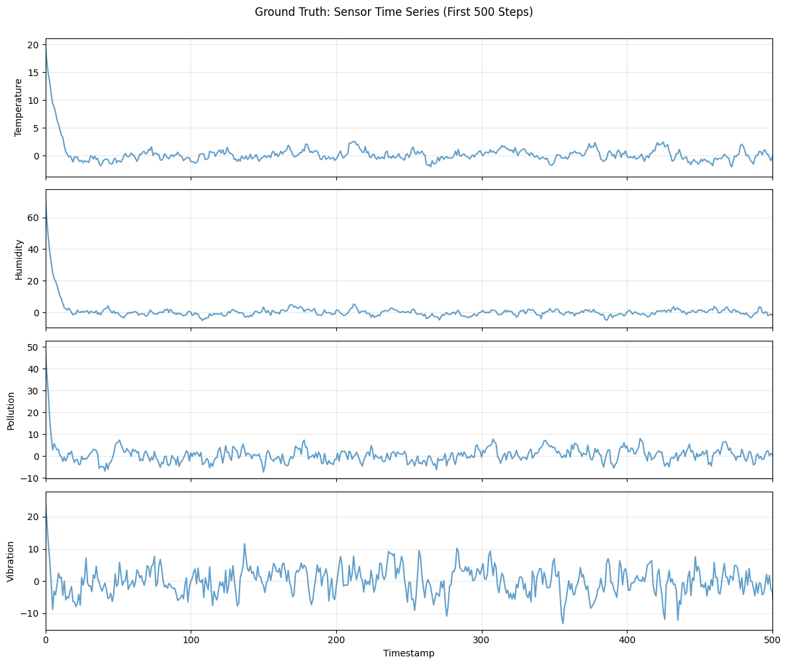

#### 🔎 What this shows
- Smooth but non-trivial temporal evolution
- Different volatility regimes across sensors
- Absence of artificial discontinuities

#### ❓ Why this matters
- Time-aware imputers (linear interpolation, forward fill) implicitly assume temporal continuity
- High-frequency variables (e.g., vibration) create a stress test for naive methods

---

### 📊 Ground Truth Distributions

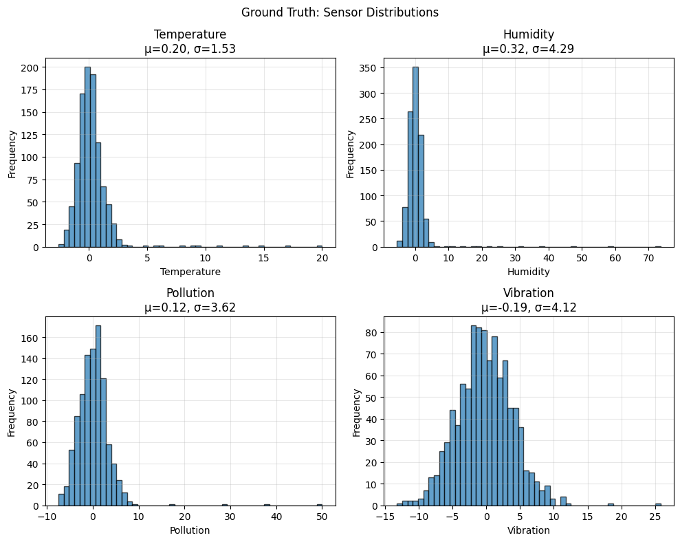

#### 🔎 What this shows
- Non-identical marginal distributions across variables
- Different variances and tail behaviors

#### ❓ Why this matters
- Mean imputation collapses variance
- Distributional metrics (KL divergence, KS test) are necessary alongside RMSE

---

### 🔥 Cross-Sensor Correlation Heatmap

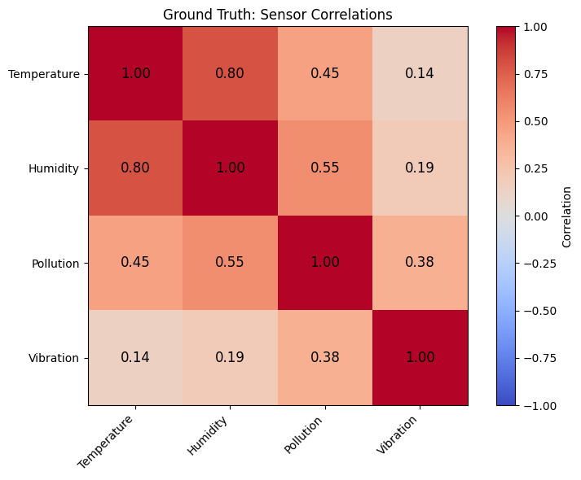

#### 🔎 What this shows
- Strong inter-variable dependencies (e.g., temperature–humidity)
- Moderate correlations across other sensors

#### ❓ Why this matters
- Enables regression-based imputation under MAR
- Demonstrates that the dataset is not a collection of independent signals

---

### 📉 Autocorrelation Structure (ACF)

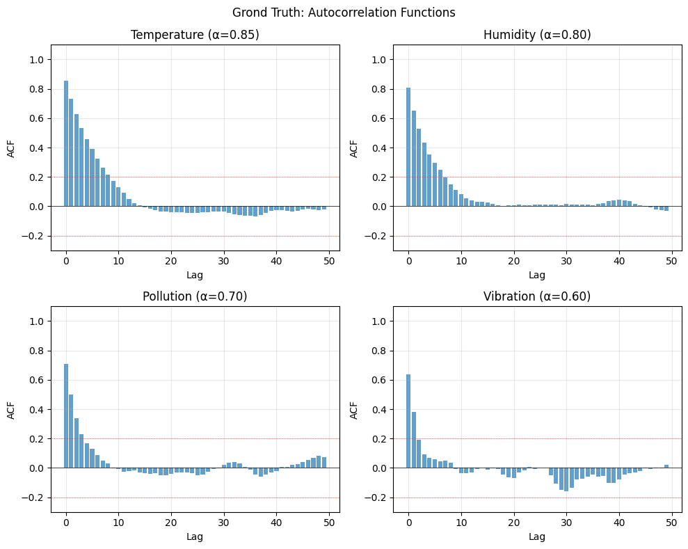

#### 🔎 What this shows
- High lag-1 autocorrelation across all sensors
- Gradual decay rather than white noise

#### ❓ Why this matters
- Justifies linear interpolation effectiveness
- Explains why forward fill can appear stable but fail during regime shifts

---

## 2️⃣ MCAR Missingness Injection & Diagnostics

> *This phase evaluates imputation under Missing Completely At Random (MCAR) — the most benign but still non-trivial missingness mechanism.*

### 🎲 MCAR Missingness Analysis

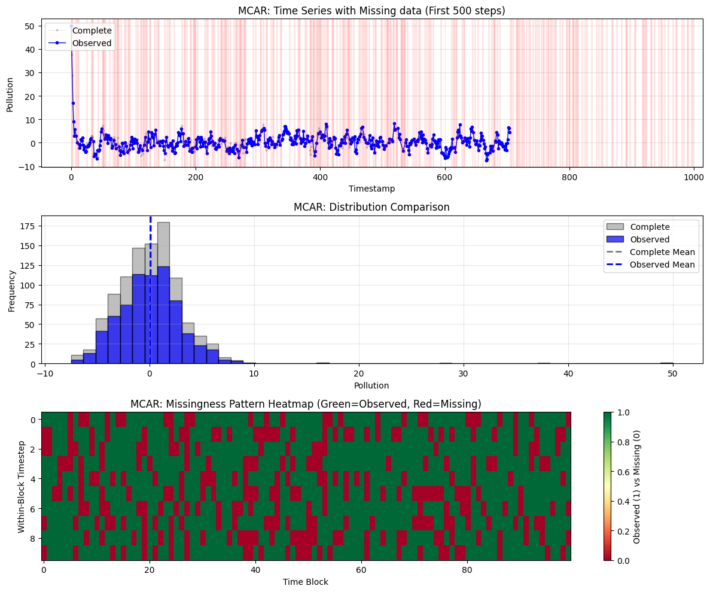

#### 🔑 Key characteristics
- Missingness is uniformly random
- Independent of observed and unobserved values
- No systematic bias introduced by the missingness process itself

#### 💡 Implication
> Any degradation in performance is due to the imputation method, not the mechanism

---

## 3️⃣ Imputation Performance under MCAR

> *This phase benchmarks multiple imputation strategies under MCAR using:*  
> `RMSE` · `MAE` · `Bias` · `Variance ratio` · `Distributional similarity`

#### 🧠 Observed behaviour (from metrics & CSVs)
- ✅ Linear interpolation consistently achieves the lowest RMSE
- ⚠️ Forward fill degrades as missing gaps lengthen
- ❌ Mean imputation introduces strong variance collapse
- 🔁 Regression and kNN provide no advantage under MCAR

#### 🎯 Key Takeaway
> 👉 **Under MCAR, exploiting temporal continuity is more effective than exploiting cross-variable correlation.**

---

## 4️⃣ MAR Missingness & Conditional Bias

> *MAR introduces missingness that depends on observed variables, creating structured bias.*

### 📉 MAR Diagnostic Plot

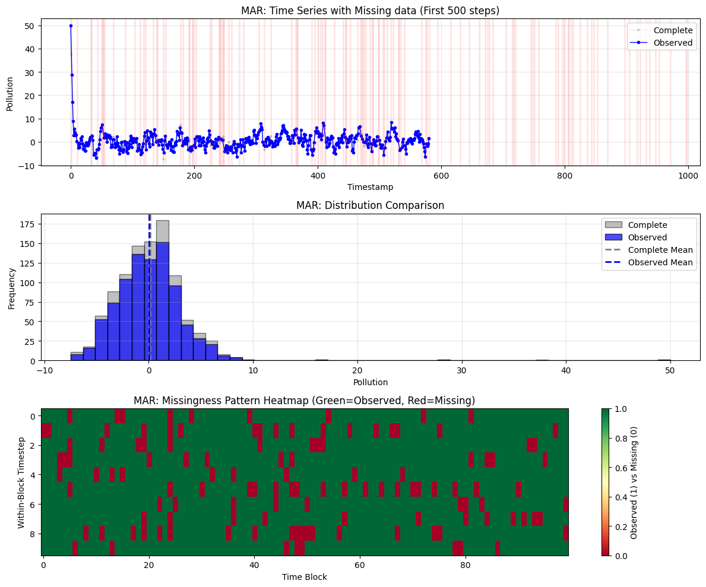

#### 🔎 What this shows
- Missingness probability increases conditionally (e.g., based on temperature or humidity)
- The dataset remains recoverable in principle

### 📊 MAR Imputation Comparison

#### 🧠 Observed behaviour
- ✅ Regression-based imputation improves relative to MCAR
- ✅ Linear interpolation remains strong
- ⚠️ Forward fill continues to lag during volatile periods

#### 🎯 Key Takeaway
> 👉 **MAR rewards methods that leverage cross-variable relationships.**

---

## 5️⃣ MNAR Missingness & Structural Bias

> *MNAR represents the most challenging and realistic failure mode.*

### ⚠️ MNAR Diagnostic Visualisation

#### 🔎 What this shows
- Missingness depends on the unobserved value itself
- Introduces selection bias
- Violates standard recoverability assumptions

#### 🧠 Observed behaviour
- 📉 Regression performance degrades
- ✅ Linear interpolation remains comparatively robust
- ❌ Mean imputation severely underestimates extremes

#### 🎯 Key Takeaway
> 👉 **Under MNAR, no method can recover truth without additional assumptions.**

---

## 6️⃣ Cross-Mechanism Comparison

> *This phase consolidates results across MCAR, MAR, and MNAR.*

### ⚖️ Bias Comparison

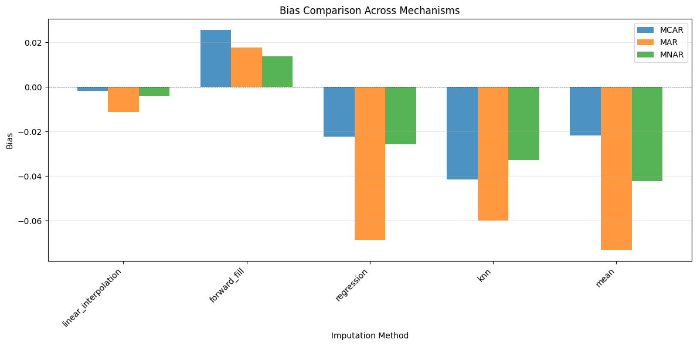

- Mean imputation shows systematic bias
- Forward fill bias increases with mechanism severity

### 📉 RMSE Comparison

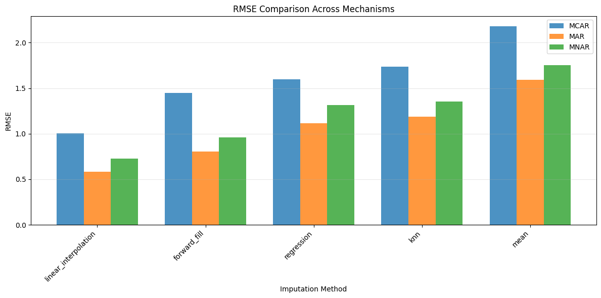

- No universally optimal method
- Linear interpolation shows strongest robustness

### 📊 Variance Preservation

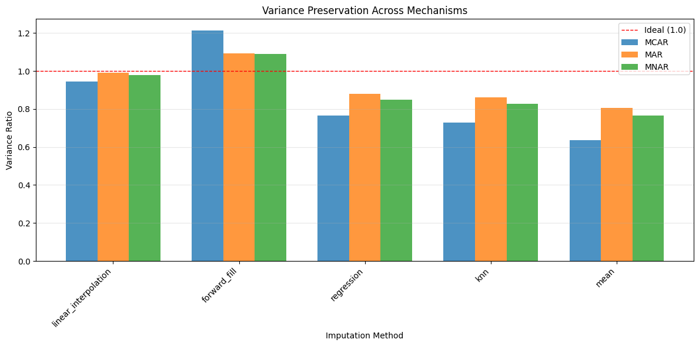

- Mean imputation collapses variance
- Forward fill inflates or collapses variance depending on gap structure

### 🌡️ RMSE Heatmap

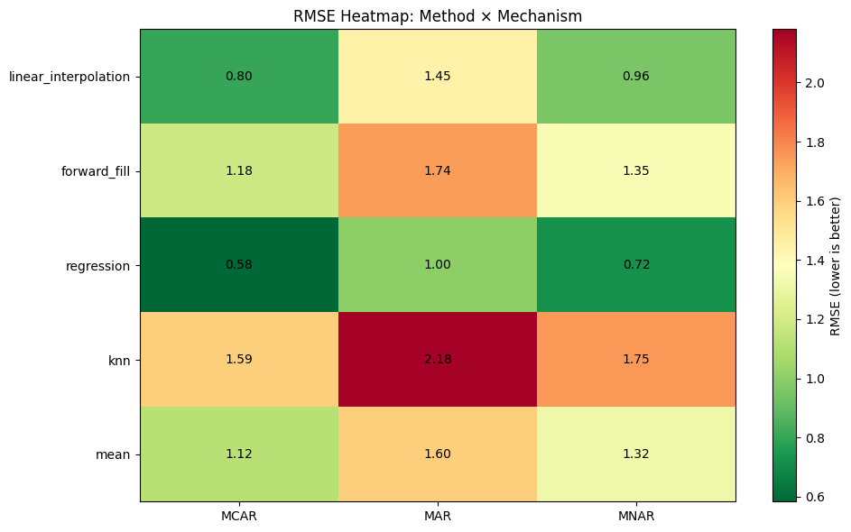

#### 🎯 Key Insight
> 👉 **Performance depends jointly on method × missingness mechanism, not method alone**

---

## 7️⃣ Sensitivity Analysis Across Missing Rates

> *This phase studies how performance changes as missingness increases.*

### 📈 RMSE vs Missing Rate

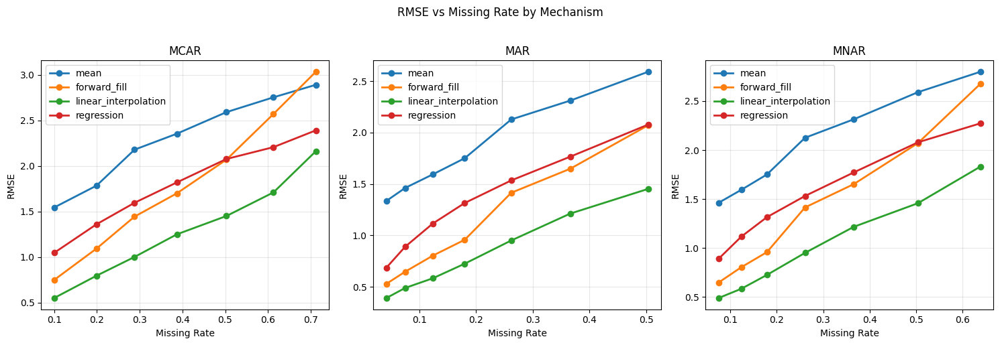

- Forward fill error grows non-linearly
- Linear interpolation degrades gracefully

### ⚖️ Bias vs Missing Rate

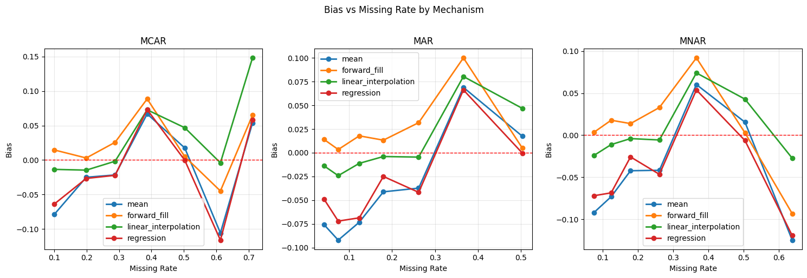

- Bias accumulation becomes dominant at high missingness

### 📊 Variance vs Missingness Rate

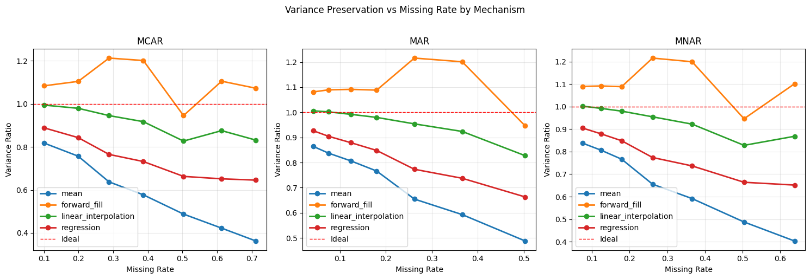

#### 🎯 Critical Insight
> 👉 **Forward fill creates long flat segments, causing instability during regime changes.**

---

## 8️⃣ Final Synthesis & Key Insights

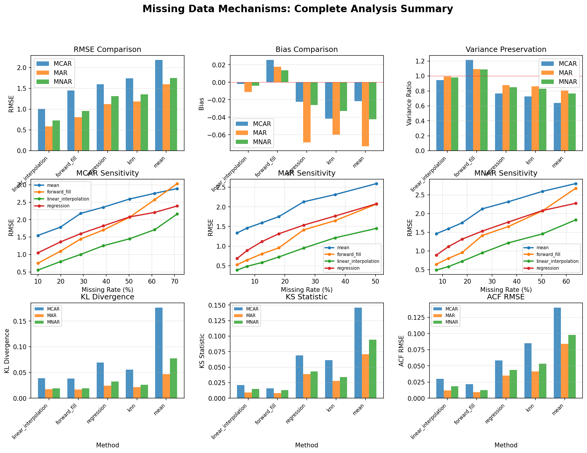

### ✅ What v1 is Capable of

- Mechanism-aware imputation evaluation
- Distributional and temporal diagnostics
- Failure-mode analysis (not just accuracy ranking)

### ⚠️ Known Limitations (Explicitly Acknowledged)

- Single imputation only (no uncertainty quantification)
- No confidence intervals
- Ground truth schema is fixed

### 🚀 v2 Roadmap (Plug-and-Play Extension)

#### Planned enhancements:

- 🔌 CSV schema adapter to map arbitrary datasets → `ground_truth.csv`
- ⚙️ Automated preprocessing (scaling, alignment, stationarity checks)
- 📊 Multiple Imputation (MI) with uncertainty bounds
- 🏭 Domain-specific templates (SDN, IoT, EV/V2G)

---
